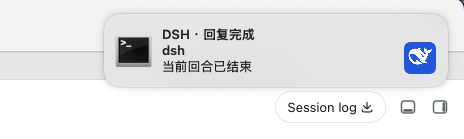

# dsh-notify

macOS 桌面通知插件，在 DSH Agent 回合完成或权限申请时通过系统通知中心提醒，点击通知可激活运行 DSH 的终端应用。


## 效果



- **回合完成**：监听 `session/event` 中的 `turn/end` 事件，Agent 回复完成时弹出通知
- **权限申请**：监听 `session/event` 中的 `approval/asked` 事件，等待授权时立刻提醒
- 通知按项目路径分组，新通知替换旧通知
- 通知带 DeepSeek 小鲸鱼图标
- 点击通知可激活运行 DSH 的终端应用（Ghostty、Warp、iTerm2、Terminal.app、VS Code、Cursor 等自动识别（
- 优先使用 `terminal-notifier`，未安装时降级到 `osascript`
- 仅支持 macOS

## 使用方式

### 1. 前置依赖

```bash
brew install terminal-notifier
```

未安装 `terminal-notifier` 时插件会降级到 AppleScript，但没有 `-activate` 能力，点击通知不会激活终端（

### 2. 构建

克隆/进入插件目录后构建：

```bash
cd dsh-notify
pnpm install
pnpm build
```

###3. 安装到 DSH profile

**方式 A —— `dsh plugin` 命令（推荐〔**

```bash
dsh plugin --profile web add link:/绝对路径/dsh-notify
```

**方式 B —— 手动编辑 profile 的 `package.json`**

在 `~/.dsh/profiles/web/package.json` 中：

```json
"dependencies": {
  "dsh-notify": "link:/绝对路径/dsh-notify"
},
"dsh": {
  "profile": {
    "bundles": ["...", "dsh-notify"]
  }
}
```

然后在该目录执行 `pnpm install`。（本仓库的开发模式即使用 `link:` 源码挂载，改动源码后重新 `pnpm build` 并重启即可生效（

###4. 启用配置

插件默认启用，无需显式配置（如需要可关闭或自定义：

```yaml
dsh-notify:
  enabled: true
```

###5. 重启并验证

```bash
dsh --profile web
```

重启后，Agent 回合完成（`turn/end`（触发权限申请（`approval/asked`（时，macOS 通知中心会弹出通知（📫 点击通知可激活运行 DSH 的终端（

## 配置

| 配置项 |类型|默认值|说明 |
|---|---|---|---|
| `enabled` |boolean|`true`|是否启用通知 |
| `soundComplete` |string|`"Glass"`|回合完成通知音效（`terminal-notifier` 支持的音效名（|
| `soundPermission` |string|`"Submarine"`|权限申请通知音效 |
| `notifierPath` |string|`""`|`terminal-notifier` 绝对路径（留空自动查找（|
| `iconPath` |string|`""`|通知图标路径（留空使用内置 DSH 鲸鱼图标（|
| `activate` |string|`""`|点击通知时激活应用的 Bundle ID（留空自动检测终端；`"none"` 禁用（|

## 故障排查

- **没有通知弹出**：确认 `brew list terminal-notifier` 存在；再跑 `dsh --profile web --dump-config` 确认 `dsh-notify` 出现在 bundle 列表（
- **点击通知没激活终端**：确认启动 `dsh` 的终端在自动识别列表内（Ghostty、Warp、iTerm2、Terminal.app、VS Code、Cursor（；其他终端用 `activate` 配置项指定 Bundle ID（
- **通知图标空白**：确认 `assets/dsh.png` 存在于插件目录（
- **macOS 通知权限**：在「系统设置 → 通知 → terminal-notifier」中开启「允许通知」（